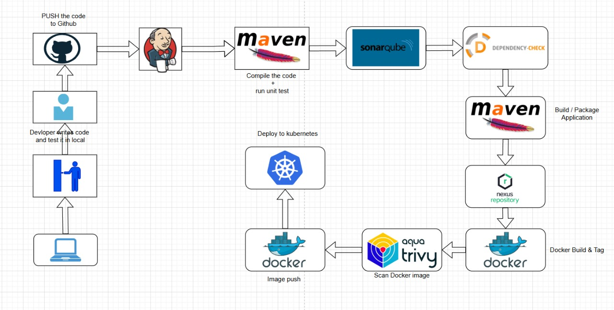

# 🛒 Spring Boot Shopping Cart Web Application

[](https://spring.io/projects/spring-boot)
[](https://www.oracle.com/java/)
[](https://maven.apache.org/)
[](https://www.docker.com/)
[](LICENSE)

## 📋 Overview



A comprehensive shopping cart web application built with Spring Boot ecosystem, featuring user authentication, session-based cart management, and secure checkout functionality. This project demonstrates modern Java web development practices with a clean, responsive interface.

### ✨ Key Features

- 🔐 **User Authentication & Registration** - Secure login system with Spring Security
- 🛍️ **Shopping Cart Management** - Session-based cart functionality per user
- 💳 **Transactional Checkout** - Reliable order processing
- 👨‍💼 **Admin Panel** - Product and user management
- 📱 **Responsive Design** - Modern UI with Thymeleaf templates
- 🗄️ **In-Memory Database** - H2 database for development

## 🏗️ Technology Stack

| Technology | Purpose |
|------------|---------|
| **Spring Boot** | Application framework |
| **Spring Security** | Authentication & authorization |
| **Spring Data JPA** | Data persistence layer |
| **Spring Data REST** | RESTful API endpoints |
| **Thymeleaf** | Server-side template engine |
| **H2 Database** | In-memory database |
| **Maven** | Build automation |
| **Docker** | Containerization |

## 🚀 Quick Start

### Prerequisites

Ensure you have the following installed:
- ☕ Java 8 or higher
- 📦 Maven 3.6+
- 🐳 Docker (optional)

### Default Credentials

| Role | Username | Password |
|------|----------|----------|
| **Admin** | `admin` | `admin` |
| **User** | `user` | `password` |

## 🔧 Running the Application

### Option 1: Maven Wrapper (Recommended)

```bash
# Make the wrapper executable
chmod +x scripts/mvnw

# Run the application
./scripts/mvnw spring-boot:run
```

**Alternative: Build and run JAR**
```bash
# Build the JAR file
./scripts/mvnw clean package

# Run the JAR
java -jar target/shopping-cart-0.0.1-SNAPSHOT.jar
```

### Option 2: Maven

```bash
# Verify Java and Maven versions
java -version
mvn -v

# Run directly
mvn spring-boot:run

# Or build and run JAR
mvn clean package
java -jar target/shopping-cart-0.0.1-SNAPSHOT.jar
```

### Option 3: Docker

```bash
# Build the application
mvn clean package

# Build Docker image
docker build -t shopping-cart:dev -f docker/Dockerfile .

# Run Docker container
docker run --rm -i -p 8070:8070 --name shopping-cart shopping-cart:dev
```

**Quick Docker setup:**
```bash
chmod +x scripts/run_docker.sh
./scripts/run_docker.sh
```

## 🌐 Access Points

Once running, access the application at:

| Service | URL | Description |
|---------|-----|-------------|
| **Main App** | http://localhost:8070/home | Shopping cart interface |
| **REST API** | http://localhost:8070/ | HAL REST Browser (auth required) |
| **Database Console** | http://localhost:8070/h2-console | H2 Database interface |

**H2 Database Connection:**
- JDBC URL: `jdbc:h2:mem:shopping_cart_db`
- Username: `sa`
- Password: (leave empty)

## 🧪 Testing

Run the test suite:
```bash
mvn test
```

## 📁 Project Structure

```
shopping-cart/
├── src/
│   ├── main/
│   │   ├── java/
│   │   └── resources/
│   │       └── application.properties
│   └── test/
├── docker/
│   └── Dockerfile
├── scripts/
│   ├── mvnw
│   └── run_docker.sh
└── target/
```

## ⚙️ Configuration

Main configuration is located in `src/resources/application.properties`. Here you can modify:
- Server port (default: 8070)
- Admin credentials
- Database settings
- H2 console path

---

# 🚀 DevOps Pipeline Setup

This section provides a complete CI/CD pipeline setup using Jenkins, SonarQube, and Nexus Repository.

## 🏗️ Infrastructure Requirements

### Virtual Machines Setup

Create **3 Virtual Machines** with the following specifications:

| VM | Purpose | Requirements | Services |
|----|---------|--------------|----------|
| **VM-1** | CI/CD Server | 4GB+ RAM | Docker + Jenkins |
| **VM-2** | Code Quality | 4GB+ RAM | Docker + SonarQube |
| **VM-3** | Artifact Repository | 4GB+ RAM | Docker + Nexus |

## 🔧 Step-by-Step Setup

### 1️⃣ VM-1: Jenkins Setup

**Install Docker and Jenkins:**
```bash
# Install Docker
curl -fsSL https://get.docker.com -o get-docker.sh
sh get-docker.sh

# Add user to docker group
sudo usermod -aG docker $USER

# Install Jenkins (or run via Docker)
docker run -d -p 8080:8080 -p 50000:50000 \
  -v jenkins_home:/var/jenkins_home \
  --name jenkins jenkins/jenkins:lts
```

### 2️⃣ VM-2: SonarQube Setup

**Install Docker and SonarQube:**
```bash
# Install Docker
curl -fsSL https://get.docker.com -o get-docker.sh
sh get-docker.sh

# Run SonarQube
docker run -d -p 9000:9000 --name sonarqube sonarqube:lts-community
```

**Access:** http://VM-2-IP:9000
- Default credentials: `admin/admin`

### 3️⃣ VM-3: Nexus Repository Setup

**Install Docker and Nexus:**
```bash
# Install Docker
curl -fsSL https://get.docker.com -o get-docker.sh
sh get-docker.sh

# Run Nexus Repository
docker run -d -p 8081:8081 --name nexus sonatype/nexus3
```

**Get initial admin password:**
```bash
# Get container ID
docker ps

# Access container and retrieve password
docker exec -it {container_id} /bin/bash
cd sonatype-work/nexus3/
cat admin.password
```

**Access:** http://VM-3-IP:8081

## 🔌 Jenkins Plugin Installation

Navigate to **Manage Jenkins > Manage Plugins** and install:

### Required Plugins
- ✅ **SonarQube Scanner**
- ✅ **Nexus Artifact Uploader**
- ✅ **Docker**
- ✅ **Docker Pipeline**
- ✅ **Docker Build Step**
- ✅ **CloudBees Docker Build and Publish**
- ✅ **OWASP Dependency-Check**
- ✅ **Eclipse Temurin Installer**
- ✅ **Config File Provider**
- ✅ **Pipeline Maven Integration**

## ⚙️ Jenkins Global Configuration

### 1. Global Tool Configuration
Navigate to **Manage Jenkins > Global Tool Configuration**:

| Tool | Configuration |
|------|---------------|
| **JDK** | Install automatically (Eclipse Temurin 11) |
| **Maven** | Install automatically (Latest) |
| **SonarQube Scanner** | Install automatically |
| **Dependency-Check** | Install automatically |
| **Docker** | Install automatically |

### 2. System Configuration
Navigate to **Manage Jenkins > Configure System**:

**SonarQube Servers:**
- Name: `SonarQube`
- Server URL: `http://VM-2-IP:9000`
- Server authentication token: `[Use credential]`

## 🔐 Credentials Setup

### SonarQube Token
1. **Generate token in SonarQube:**
   - Go to SonarQube → User → My Account → Security
   - Generate new token

2. **Add to Jenkins:**
   - **Manage Jenkins > Manage Credentials > Global**
   - Add **Secret Text** credential
   - ID: `sonarqube-token`
   - Secret: `[Generated token]`

### Docker Credentials
**Add Docker Hub credentials:**
- **Manage Jenkins > Manage Credentials > Global**
- Add **Username with password**
- ID: `docker-hub-credentials`
- Username: `[Your Docker Hub username]`
- Password: `[Your Docker Hub password]`

### Nexus Credentials
**Add Nexus credentials:**
- **Manage Jenkins > Manage Credentials > Global**
- Add **Username with password**
- ID: `nexus-credentials`
- Username: `admin`
- Password: `[Retrieved from nexus container]`

## 📄 Maven Settings Configuration

Navigate to **Manage Jenkins > Managed Files > Add New Config**:

**Config Type:** Global Maven settings.xml
**ID:** `maven-settings`

**Content:**
```xml
<?xml version="1.0" encoding="UTF-8"?>
<settings xmlns="http://maven.apache.org/SETTINGS/1.0.0"
          xmlns:xsi="http://www.w3.org/2001/XMLSchema-instance"
          xsi:schemaLocation="http://maven.apache.org/SETTINGS/1.0.0 
          http://maven.apache.org/xsd/settings-1.0.0.xsd">
  
  <servers>
    <server>
      <id>maven-releases</id>
      <username>admin</username>
      <password>{your_nexus_password}</password>
    </server>
    <server>
      <id>maven-snapshots</id>
      <username>admin</username>
      <password>{your_nexus_password}</password>
    </server>
  </servers>
  
</settings>
```

## 🔄 Pipeline Creation

1. **Create New Item** in Jenkins
2. Select **Pipeline**
3. Configure pipeline with your repository
4. Set up webhook triggers
5. Define your `Jenkinsfile` with stages:
   - Code Checkout
   - Maven Build
   - Unit Tests
   - SonarQube Analysis
   - Security Scan (OWASP)
   - Docker Build
   - Push to Registry
   - Deploy

## 📊 Monitoring & Access

| Service | URL | Purpose |
|---------|-----|---------|
| **Jenkins** | http://VM-1-IP:8080 | CI/CD Pipeline |
| **SonarQube** | http://VM-2-IP:9000 | Code Quality |
| **Nexus** | http://VM-3-IP:8081 | Artifact Repository |

## 🎯 Next Steps

1. ✅ Complete infrastructure setup
2. ✅ Configure all tools and credentials
3. 🔄 Create your first pipeline
4. 📈 Monitor build metrics and quality gates
5. 🚀 Implement automated deployments

---
  
## 🤝 Contributing

1. Fork the repository
2. Create your feature branch (`git checkout -b feature/AmazingFeature`)
3. Commit your changes (`git commit -m 'Add some AmazingFeature'`)
4. Push to the branch (`git push origin feature/AmazingFeature`)
5. Open a Pull Request

